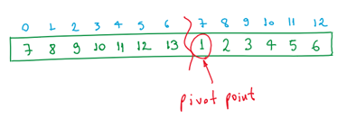

# Problem 2: Search in a Rotated Sorted Array

The solution for this problem considers an array in ascending order (e.g. _[4,5,6,7,0,1,2]_ ). The algorithm input ***n*** will correspond to the array size.

This problem was solved by an algorithm divided in two parts:
* Fist it seeks for the position of the lowerest value in the rotated array (pivot point), wich will divide it in two ordered subarrays. 
* Then the algorithm uses a search method in each subarray looking for the giving number.

The search for the smallest value (pivot point) is performed by dividing the array interval that is being analysed in two parts by a `middle` pointer. The purpose is to seek for the unordered half, meaning that the lowest value should come right after the highest array value in this part. The only case where this does not occur is for an unrotated array. An recursive approach was considered here, so the ordered half is discarded and the algorithm recurses to analyse the other part. The algorithm can stop when the interval has only two values, then it can easily select the lowest.

This first part uses an binary seach based algorithm which will always (best and worst cases, considering that the search process always reach a "leaf") lead to an ***O(log n)*** time complexity. 

Now that the algorithm knows the pivot location the second part uses a simple binary search in each ordered subarray.  In the worst case, in which the pivot is positioned at the center of the array, the subarrays will have the same size of ***n/2***. Thus, the algorithm will behave as 2 * O(log n/2), wich results in a ***O(log n)*** time complexity for this part.

Considering a constant number of binary searches (maximum of three), the time complexity for the entire algorithm is still ***O(log n)*** as requested in the problem statement.

Regarding to space, the algorithm uses only a couple of auxiliary variables. Since the division processes mentioned before and the binary seaches are both based on index positioning over the original array, no special data structure was required. Although, considering the recursive approach used, the Python interpreter needs to stack theses auxiliaries at each recursive call. Thus it leads to an ***O(log n)*** space complexity.
