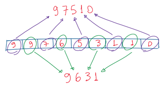
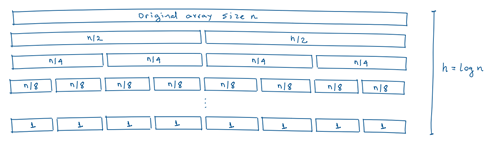

# Problem 3: Rearrange Array Elements

The algorithm input _**n**_ corresponds to the input array size.

This problem was solved by an algorithm divided in two main parts:
* Fist the input array is sorted descending, which allaws it to be traversed from the higher to lower values.
* Then the algorithm equally distributes the array number values into the two resulting numbers. The higher the number in the array the more significant digit it will represent in the final result.

The first part uses an merge sort algorithm which was seen in Lesson 2, but modified to produce the descending sorting. This algorithm behaves in _**O(n log n)**_ time complexity.

In the second part the algorithm traverses the even indexes of the ordered array to produce the first resulting number and then it traverses the odd indexes to produce the second number. At each iteration the current accumulated number is “shifited left” by multiplying it by 10, which makes room to sum the current index evaluated. Each traversal looks at half of the array the same size of n/2. Thus it will behave as 2 * O(n/2), wich results in a _**O(n)**_ time complexity.

To address a array consistency verification at the beginning the algorithm makes an additional computation to traverse it looking for invalid entries, which results in an _**O(n)**_ time complexity.

Considering all parts depicted before, the overall time complexity for this algorithm will result 
in O(n log n) + O(n) + O(n), which is correspondent to O(max(n*log(n), n, n)), thus resulting
in _**O(n log n)**_.

Regarding to space, the algorithm creates a new array to sort the input, which behaves as O(n). Although, the sorting algorithm itself, considering the recursive version of merge sort and the divide and conquer approach, stacks up multiple input array part instances along the division process. This results in a _**O(n log n)**_ behavior in space complexity. 

The second part that computes resulting numbers is based on iteration loops that relies on the Python _**range()**_ built-in function, which creates an iterator (not a list) that behaves in _**O(1)**_ space complexity. The overall space complexity will result O_**(n log n)**_.

