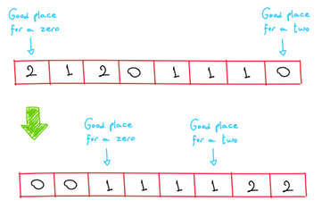

# Problem 4: Dutch National Flag Problem

The algorithm input n corresponds to the input list size.

This problem was solved by scrolling through the list and swapping numbers by pushing 0s back to the beginning and pushing 2s to the end. 

The algorithm basically needs two pointers (one to indicate a next location that is good for a _**0**_ and one to indicate a next location that is good for a _**2**_) performing three different actions, depending on whether the current index value is equal to:

_**0**_ 
* Pushes the 0 back to beginning part of the list.
* Increments the index to next position to receive a _**0**_.
* Increments the list index to check the next item.

_**2**_ 
* Pushes the 2 forth to the final part of the list.
* Decrements the index to next position to receive a _**2**_.
* Since the current position received an exchanged value, check it again.

_**1**_ 
* Do nothing. The 1 might be at the right place.
* Increments the list index to check the next item.

This algorithm only traverses the list one time. So it behaves as _**O(n)**_ time complexity. 

Regarding to space, the algorithm makes the sorting in place and it needs only a few auxiliaries. So it has a space complexity of _**O(1)**_.
